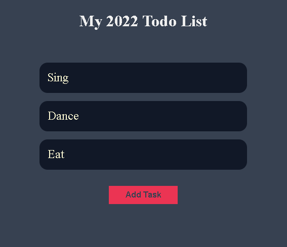
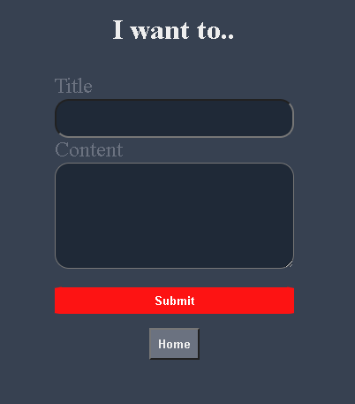
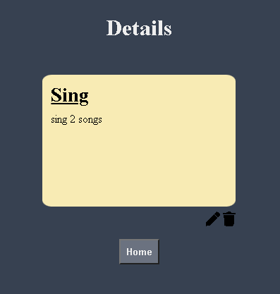
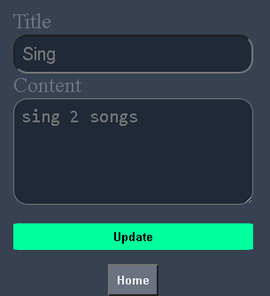

# Nodejs + MongoDB Todo List

## A website built with NodeJS and use MongoDB as database, with the basic CRUD function 

 
Have some new idea? Click the add task button

 

Write it down and don't forget to give it some description 
 

Click on any single todo title will bring you to the detail page which will show up the description along with the title 
 

The pen icon's function is to edit post and trash can is delete post 
 

## Express and Mongoose 

I used express and mongoose to build this web because these frameworks are the most recent trends in web developing. Besides that, I use ejs to transfer 'props' from backend to frontend. Since this is my first backend website, it is just a simple app with basic CRUD function, but of course it do have RWD, try it on phone~

## Thank you
